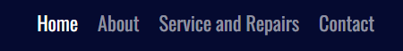
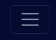
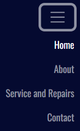
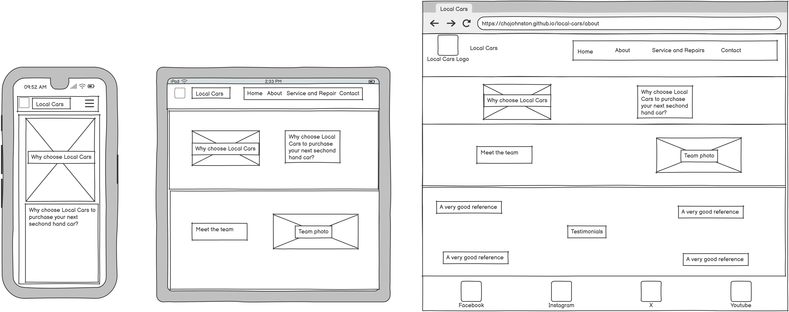
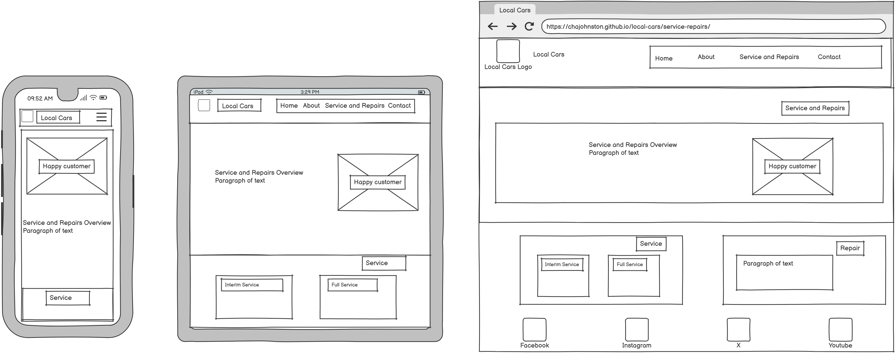
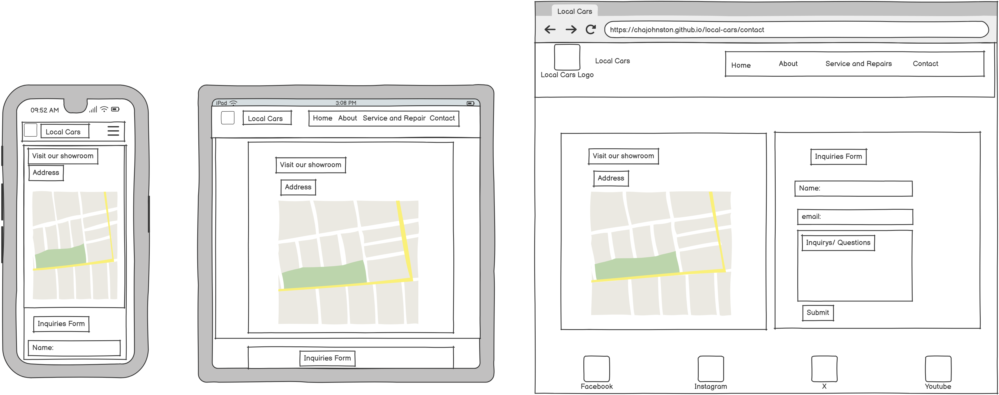
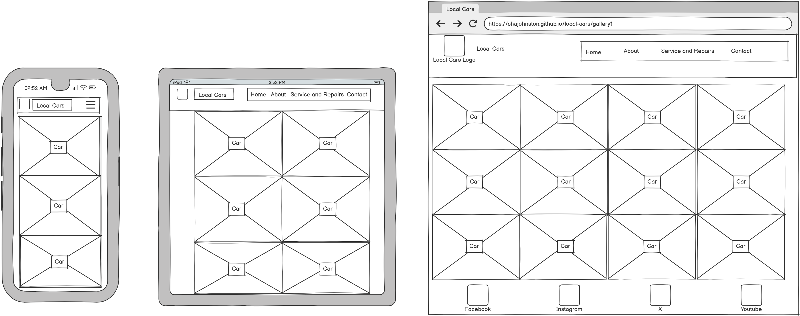

# Local Cars

# Overview

The Local Cars website is a landing page for perspective buyers of used cars in your local area.

# Table of Contents

1. [Overview](#overview)
1. [User Experience](#user-experience)
1. [Design](#design)
1. [Features](#features)

# User Experience

## Target Audience

- Ages 17-60 but can appeal to all ages.
- All genders.
- Anyone currently looking to purchase a second hand car.

## First Time Visitor Goals

- Immediatly know what the specific purpose of the website is and look favorably to buy a car at local cars. This would require knowing the address and type of cars available.

## Returning Visitor Goals

- Use the form to ask for additional information.
- Browse the cars and their gallery to help them make decisions.

## Frequent Visitor Goals

- Use the social links to connect with like minded people.
- Use the map/address to visit the garage directly for a viewing.

# Features

## Navbar

A navigation menu with clearly defined links.

- Home - to navigate back to the homepage at anytime - also can be accessed by clicking the Kiwi Kamper logo.
- About - to navigate to the 'about' page.
- Service and Repairs - to navigate to the 'service and repairs' page.
- Contact - to navigate to the map and contact form.

Navbar desktop view:

Navbar mobile closed view:

Navbar mobile open view:

### Navbar Interaction

- Current page will be brighter in the navbar.
- Clicking on logo or navbar header will always return user to homepage.
- Menu transforms into a 'hamburger' menu on smaller devices or when window is reduced.

## Favicon

- Car favicon icon in site tab to match webiste theme.

Themed favicon:

# Design

### Colours

- Deep blue color combination was choosen.
- White text is also to be used throughout the website.

Colour palette:

### Fonts

- Google fonts supplied all text styles.
- Oswald font used on 'home' and 'contact' pages.
- Lato used on 'about' and 'service and repairs' pages.

- Font Awesome was used for the social media link icons, the logo icon and for the favicon icon.

# Wireframes

- Balsamiq was used to create the wireframes.

Home page:

About page:

Service and Repairs page:

Contact page:

Gallery page:

# Deployment

### Github Pages

The site was deployed to Github Pages using the following method:

- Go to the Github repository.
- Navigate to the 'settings' tab.
- Using the 'select branch' dropdown menu, choose 'main'.
- Click 'save'.

### Local deployment and cloning

To make a clone of the site and ensure you don't affect the original:

- Navigate to the Github repository that you want to clone.
- Click on the 'down'arrow on the green 'code' button.
- Copy the URL link.
- Open the workspace with the green 'open' button.
- In the command terminal enter 'git clone' followed by the copied url.
- Press enter to create the clone.

# Testing

# References

### Images

All images are royalty free and were taken from allowed sources. Images are downloaded and added to the assets file to ensure no broken links arise.
All images were taken from:

- https://www.pexels.com/

### Code

Some code copied and pasted as a guide and highly edited to suit the site theme.

Navbar and hamburger menu:

- https://getbootstrap.com/docs/5.3/components/navbar/

Homepage cards of cars:

- https://getbootstrap.com/docs/5.3/components/card/

About page:

- https://getbootstrap.com/docs/5.3/layout/containers/
- https://getbootstrap.com/docs/5.3/layout/grid/

Service and Repairs page:

- https://getbootstrap.com/docs/5.3/layout/containers/
- https://getbootstrap.com/docs/5.3/layout/grid/

# Tools and Technologies

- [HTML](https://en.wikipedia.org/wiki/HTML) was used to write the website code.
- [CSS](https://en.wikipedia.org/wiki/CSS) was used to style the website.
- [Bootstrap](https://getbootstrap.com/) was used for the site layout.
- [Github](https://github.com) and Github Pages to deploy and host the website.
- [FontAwesome](https://fontawesome.com/) for website icons and the favicon.
- [Google](https://www.google.com/) as a search engine for all queries.
- [GoogleChrome](https://www.google.com/chrome/) to test and view website.
- [GoogleDevTools](https://developer.chrome.com/docs/devtools) to identify bugs and general website tailoring.
- [Convertio](https://convertio.co/) to convert images from png to webp.
- [MicrosoftPaint](https://www.microsoft.com/en-gb/windows/paint) to resize images.
- [coolors](https://coolors.co/) to create the colour palette.
- [Balsamiq](https://balsamiq.com/) to create the wireframes.
- [VScode](https://code.visualstudio.com/) to write the code.

# Acknowledgements

Thanks to my cohort facilitator Lewis Dillon.