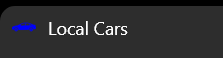
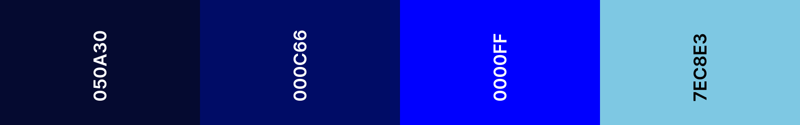
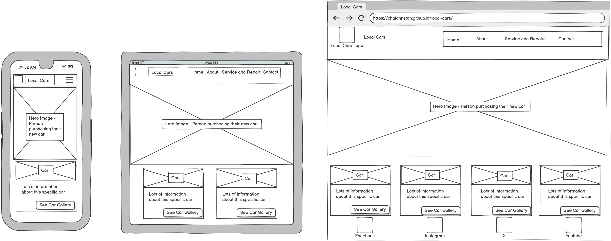

# Local Cars

# Overview
The Local Cars website is a landing page for perspective buyers of used cars in your local area.

# Table of Contents

1. [Overview](#overview)
1. [User Experience](#user-experience)
1. [Design](#design)

# User Experience

## Target Audience

- Ages 17-60 but can appeal to all ages.
- All genders.
- Anyone currently looking to purchase a second hand car. 

## First Time Visitor Goals

- Immediatly know what the specific purpose of the website is and look favorably to buy a car at local cars. This would require knowing the address and type of cars available. 

## Returning Visitor Goals

- Use the form to ask for additional information. 
- Browse the cars and their gallery to help them make decisions.

## Frequent Visitor Goals

- Use the social links to connect with like minded people.
- Use the map/address to visit the garage directly for a viewing.

# Features

## Navbar

A navigation menu with clearly defined links.
- Home - to navigate back to the homepage at anytime - also can be accessed by clicking the Kiwi Kamper logo.
- About - to navigate to the 'about' page.
- Service and Repairs - to navigate to the 'service and repairs' page. 
- Contact - to navigate to the map and contact form.

Navbar desktop view:

Navbar mobile closed view:

Navbar mobile open view:

### Navbar Interaction

- Inverted colours when menu items are hovered over.
- Current page will be underlined in the navbar.
- Clicking on logo will always return user to homepage.
- Menu transforms into a 'hamburger' menu on smaller devices or when window is reduced.

## Favicon

- Car favicon icon in site tab to match webiste theme.

Themed favicon:

# Design

### Colours

- Deep blue color combination was choosen.

Colour palette:

### Fonts

- Google fonts supplied all text styles.
- Oswald font used on 'home' and 'contact' pages.
- Lato used on 'about' and 'service and repairs' pages.

- Font Awesome was used for the social media link icons, the logo icon and for the favicon icon.

# Wireframes

- Balsamiq was used to create the wireframes.

Home page:

About page:

Service and Repairs page:

Contact page:

Gallery page:

